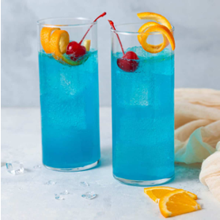

# Blue Lagoon

{ loading=lazy }

| :timer_clock: Total Time |
|:-----------------------: |
| 0 minutes |

## :salt: Ingredients

- some limoen
- 1 ijsblokjes.
- 60 ml Blue Curacao siroop
- 60 ml tonic
- 240 ml citroenlimonade
- some limoen
- 2 pcs" kersen

## :cooking: Cookware

- 1 glas
- 1 stamper.

## :pencil: Instructions

### Step 1

Doe een halve limoen in stukjes in het glas en stamp dit fijn met een stamper.

### Step 2

Vul het glas dan voor ¾ deel met ijsblokjes.

### Step 3

Voeg de Blue Curacao siroop toe aan het glas.

### Step 4

Vul aan met tonic en citroenlimonade

### Step 5

Garneer met limoen  en kersen
