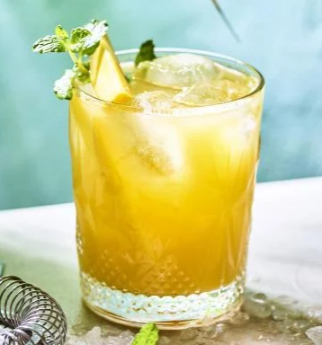

# Mango Mule

{ loading=lazy }

| :timer_clock: Total Time |
|:-----------------------: |
| 0 minutes |

## :salt: Ingredients

- 0.25 pcs mango
- 0.5 pcs limoen
- 100 ml gemberbier
- 1 takje munt

## :cooking: Cookware

## :pencil: Instructions

### Step 1

Snij het vruchtvlees van de mango in stukjes.

### Step 2

Hou een paar stukjes apart voor de afwerking en doe de rest in de blender.

### Step 3

Voeg het sap van de limoen toe en mix glad.

### Step 4

Vul een tumblerglas  met wat ijsblokjes en vul het met mango-limoensap.

### Step 5

Vul het glas aan met het gemberbier.

### Step 6

Werk de mocktail af met een takje munt en een paar kleine stukjes mango.
