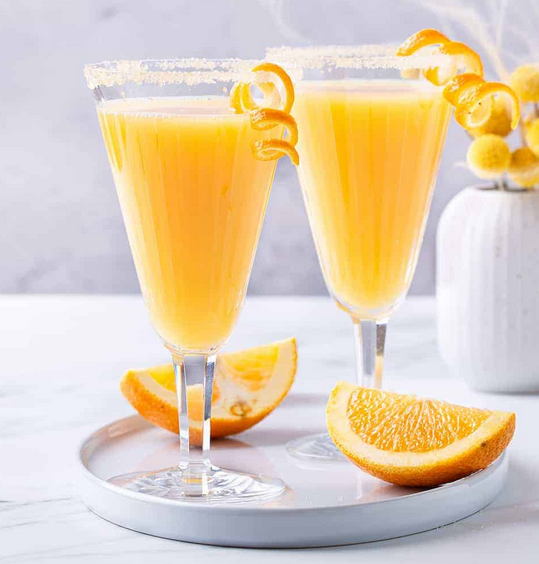

# Mimosa

{ loading=lazy }

| :timer_clock: Total Time |
|:-----------------------: |
| 0 minutes |

## :salt: Ingredients

- 4 pcs sinaasappel
- 2 schijfjes gember
- 1 glas Ginger Ale

## :cooking: Cookware

- 1 Pers

## :pencil: Instructions

### Step 1

Snij de sinaasappel door de helft. Snij enkele sneetjes af en hou apart ter decoratie.

### Step 2

Snij enkele dunne schijfjes van de gember.

### Step 3

Pers de sinaasappel.

### Step 4

Meng het vruchtensap met de Ginger Ale .

### Step 5

Verdeel de mix over 2 glazen.

### Step 6

Decoreer het geheel met de gember en schijfjes sinaasappel.
