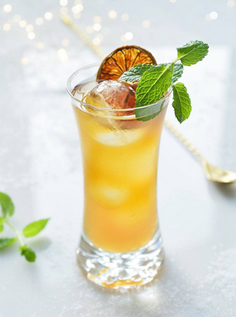

# Paloma Palmer

{ loading=lazy }

| :fork_and_knife_with_plate: Serves | :timer_clock: Total Time |
|:----------------------------------:|:-----------------------: |
| 1 | 0 minutes |

## :salt: Ingredients

- 1 ijsblokjes
- 5 cl Earl Grey thee
- 2 cl limoensap
- 1.5 cl agavesiroop
- 8 cl pompelmoessap
- 1 bruiswater.
- 1 takje munt
- 1 schijfje citroen

## :cooking: Cookware

## :pencil: Instructions

### Step 1

In La Capilla (Tequila, Mexico) waar de klassieke Paloma werd uitgevonden worden de cocktails steeds met een mes geroerd
in plaats van met een cocktaillepel.

### Step 2

Bereiden:

### Step 3

Vul een groot longdrink glas met ijsblokjes

### Step 4

Voeg toe de Earl Grey thee, limoensap, agavesiroop en de pompelmoessap

### Step 5

Roer het drankje goed om en top de cocktail af met een heel klein beetje bruiswater.

### Step 6

Garneer met een takje munt en (gedroogd) schijfje citroen.
