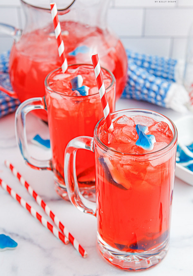

# Shark Attack

{ loading=lazy }

| :timer_clock: Total Time |
|:-----------------------: |
| 0 minutes |

## :salt: Ingredients

- 1 cup ananassap
- some sinaasappelsap
- some cranberrysap
- some Ginger Ale
- some grenadine
- 1 ijsblokjes

## :cooking: Cookware

- 1 kan
- 1 kom
- 1 glazen

## :pencil: Instructions

### Step 1

### Step 2

Meng in een grote kan of kom het ananassap, sinaasappelsap en cranberrysap.

### Step 3

Voeg de Ginger Ale  toe en roer voorzichtig om de ingrediënten te combineren.

### Step 4

Voeg de grenadine toe en roer opnieuw voorzichtig om een bloedachtig effect te creëren.

### Step 5

Vul glazen met ijsblokjes en schenk de mix erover.

### Step 6

Garneer elk glas met een schijfje citroen of sinaasappel.
