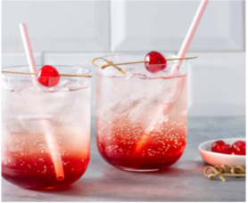

# Shirley Temple

{ loading=lazy }

| :timer_clock: Total Time |
|:-----------------------: |
| 0 minutes |

## :salt: Ingredients

- 25 ml grenadine
- 100 ml Sprite
- 100 ml Ginger Ale
- 4 pcs kersen

## :cooking: Cookware

- 1 glas
- 1 ijsblokjes.
- 1 cocktailprikker

## :pencil: Instructions

### Step 1

Schenk het glas voor de helft vol met ijsblokjes.

### Step 2

Schenk de grenadine in het glas en vul aan met Sprite en Ginger Ale.

### Step 3

Roer het geheel voorzichtig door elkaar.

### Step 4

Rijg de kersen aan de cocktailprikker en leg op het glas.
