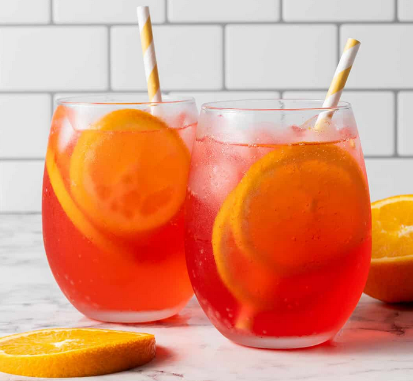

# Spritz of Sunshine

{ loading=lazy }

| :fork_and_knife_with_plate: Serves | :timer_clock: Total Time |
|:----------------------------------:|:-----------------------: |
| 4 | 0 minutes |

## :salt: Ingredients

- some citroensap
- 5 cm citroenschil
- some salieblaadjes
- some tijm
- 1 ijs,
- some grapefruitsap
- some granaatappelsap
- some druivensap
- some appelciderazijn
- some bruiswater
- 1 schijfje sinaasappel

## :cooking: Cookware

- 1 cocktailshaker
- 1 zeef
- 4 glazen

## :pencil: Instructions

### Step 1

Voeg het citroensap, citroenschil, salieblaadjes, tijm toe aan een glas en plet ze samen met een muddler.

### Step 2

Deze stap is belangrijk en zal helpen om die heerlijke smaken vrij te geven.

### Step 3

Voeg het geplette mengsel toe aan een cocktailshaker met ijs, samen met grapefruitsap, granaatappelsap, druivensap en
appelciderazijn

### Step 4

Schud gedurende 10 seconden en zeef in 4 glazen met ijs.

### Step 5

Elk glas moet ongeveer ⅔ gevuld zijn.

### Step 6

Garneer met bruiswater en garneer met kruiden en een schijfje sinaasappel.
