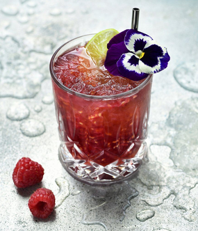

# Virgin Red Cheecks

{ loading=lazy }

| :fork_and_knife_with_plate: Serves | :timer_clock: Total Time |
|:----------------------------------:|:-----------------------: |
| 1 | 0 minutes |

## :salt: Ingredients

- 1 ijsblokjes
- 3 cl frambozencoulis
- 2 cl limoensap
- 1 cl violetsiroop
- some crushed ice
- some Ginger Ale 
- 1 pcs limoenpartje

## :cooking: Cookware

- 1 shaker
- 1 zeef
- 1 tumblerglas.
- 1 rietje.

## :pencil: Instructions

### Step 1

Vul een shaker met ijsblokjes en voeg de frambozencoulis, het limoensap en de violetsiroop toe. Sluit de shaker en shake
krachtig tot de shaker ijskoud aanvoelt. Minimaal 2 minuten

### Step 2

Zeef de cocktail met een groffe zeef in een voorgekoeld tumblerglas. Vul het glas met crushed ice en top af met Ginger
Ale  . Garneer met een limoenpartje en een (milieuvriendelijk) rietje.
